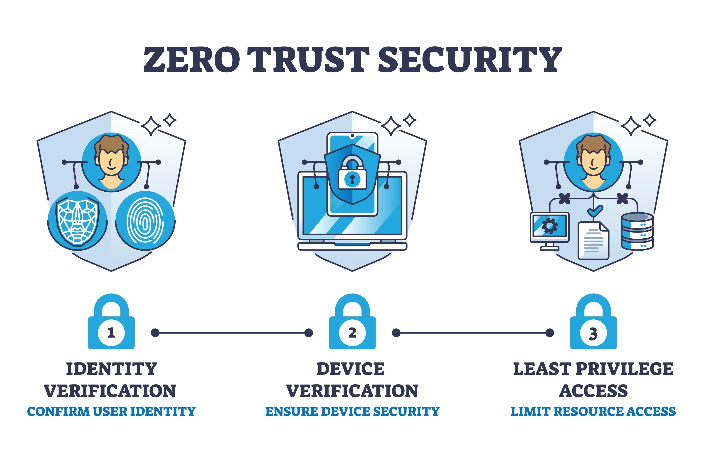

# HASS-SAG

**Home Assistant Secure Access Generator**

A CLI tool that sets up Cloudflare mTLS to make your home services invisible to the public internet. Devices with your certificate get seamless access — no challenges, no popups. Devices without it don't even see a login page.



## Quick Start

```bash
bunx hass-sag
```

Prerequisites: [Bun](https://bun.sh/) (or Node.js v22+) and [OpenSSL](https://www.openssl.org/).

## Features

- **mTLS Certificate Management** — generate keys, CSR, PKCS#12 bundles, Apple profiles
- **Cross-Platform Installation** — auto-install certs on macOS, Windows, Linux (iOS/Android guided)
- **Cloudflare API Automation** — upload certs, manage WAF rules, verify HASS settings
- **WAF Rule Management** — create/optimize rules within the 5-rule free tier limit
- **Certificate Rotation** — zero-downtime renewal with automatic old cert revocation
- **Family Distribution** — download portal with per-platform instructions behind CF Access OTP
- **HASS Verification** — check WebSocket, HTTP/2, SSL, TLS settings with auto-fix

## Supported Platforms

| Platform | Cert Install | Auto-Selection | How |
|:---------|:-------------|:---------------|:----|
| macOS | Yes | Zero popup | `security set-identity-preference` |
| iOS/iPadOS | Yes | Zero popup | `.mobileconfig` identity preference |
| Windows | Yes | First-visit popup | Browser remembers choice |
| Linux | Yes | Zero popup | Chrome `AutoSelectCertificateForUrls` policy |
| Android | Yes | First-visit popup | Browser remembers choice |

## Roadmap

- [Web Companion App](./docs/roadmap/spa-web-companion.md)
- [Windows Chrome Auto-Selection](./docs/roadmap/windows-auto-select.md)

## Documentation

Full documentation: **[docs/index.md](./docs/index.md)**

| Guide | |
|:------|:--|
| [Getting Started](./docs/getting-started.md) | Prerequisites, installation, first run |
| [Cloudflare Setup](./docs/cloudflare-setup.md) | One-time CF dashboard configuration |
| [Troubleshooting](./docs/troubleshooting.md) | Common issues and solutions |

## Development

```bash
git clone https://github.com/naorz/hass-sag.git && cd hass-sag
bun install
bun run dev
```

## Links

- [Cloudflare Zero Trust Dashboard](https://one.dash.cloudflare.com/)
- [Cloudflare mTLS Documentation](https://developers.cloudflare.com/cloudflare-one/identity/devices/mutual-tls-authentication/)

## License

MIT
